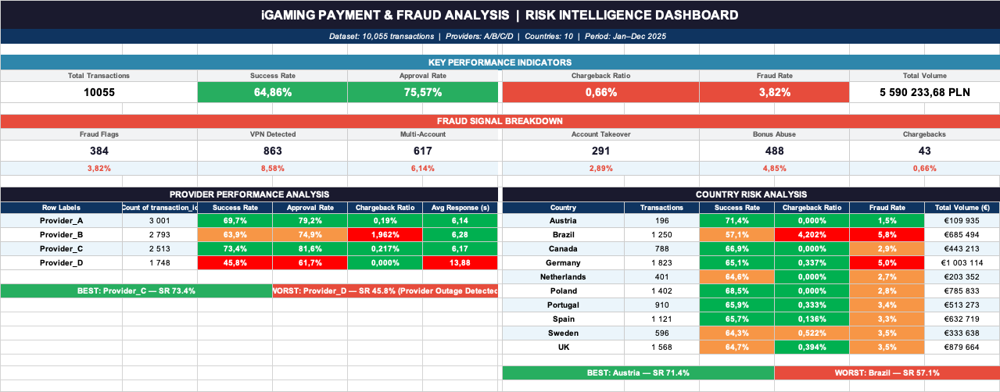

# Gaming Payment Operations & Fraud Analysis (2025)

## Project Overview

This project analyses 10,055 payment transactions across 4 payment providers and 10 countries. The goal was to simulate the work of a Junior Payment Operations / Fraud Analyst by monitoring payment performance, identifying operational issues, and investigating suspicious transaction patterns.

## Dashboard KPIs

* Total Volume: €5,590,234
* Success Rate: 64.9%
* Approval Rate: 75.6%
* Chargeback Ratio: 0.66%
* Fraud Flag Rate: 3.82%

## Key Findings

### Provider Performance

Provider_D showed the weakest performance among all providers, with a Success Rate of 45.8% and an average response time of 13.9 seconds. The provider also recorded the highest share of approved but unsuccessful transactions.

### Chargeback Risk

Brazil recorded the highest chargeback rate in the dataset (2.4%) and generated the largest number of chargebacks compared to other countries.

### Multi-Account Activity

617 transactions were flagged as multi-account activity (6.1% of all transactions). Activity was observed across multiple countries, with Germany, UK and Brazil generating the highest volumes.

### Card Testing Investigation (PL00001)

A review of Player PL00001 identified a pattern consistent with card testing activity. The account completed 25 low-value deposits within a short period of time, significantly exceeding normal transaction behaviour.

## Investigation Summary

### Case Study: Card Testing Pattern (PL00001)

Findings:

* 25 deposits completed within 50 minutes
* Unusually high transaction frequency
* Low average transaction value
* Multiple payment instruments used

Recommended Actions:

* Review account activity
* Apply velocity controls for rapid repeated deposits
* Introduce additional verification for similar behaviour patterns

## Tools Used

* Microsoft Excel
* Pivot Tables
* XLOOKUP
* COUNTIFS
* SUMIFS
* IF Functions
* Dashboard Reporting

## Concepts Covered

### Payment Operations

* Approval Rate
* Success Rate
* Chargeback Ratio
* Provider Performance Monitoring
* Payment Flow Analysis

### Fraud & Risk

* Card Testing
* Multi-Accounting
* Chargeback Monitoring
* Transaction Velocity Analysis
* Fraud Flag Review
